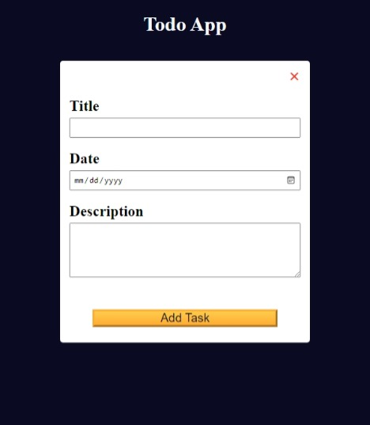

# To Do App Project from freeCodeCamp

This is a project from freeCodeCamp's JavaScript Algorithms and Data Structures course. I wanted to create a repo for it for future reference and understand how to implement a functional component with JavaScript.

### Screenshot



### Links

- [View Code](https://www.example.com)
- [Live Preview](https://www.example.com)

## My process

### Built with

- HTML
- CSS
- JavaScript

### What I learned

- localStorage
- How to implement multiple functionalities for a single button depending on context and how to organize the code accordingly
- addEventListener cannot be used on an element created with JavaScript, so onclick attribute can be used when creating it inside JS code.
- e.preventDefault() should be used to prevent a click on the submit button from refreshing the page.

### Useful resources

- [localStorage property](https://developer.mozilla.org/en-US/docs/Web/API/Window/localStorage)
- [```<dialog>``` element](https://developer.mozilla.org/en-US/docs/Web/HTML/Element/dialog)